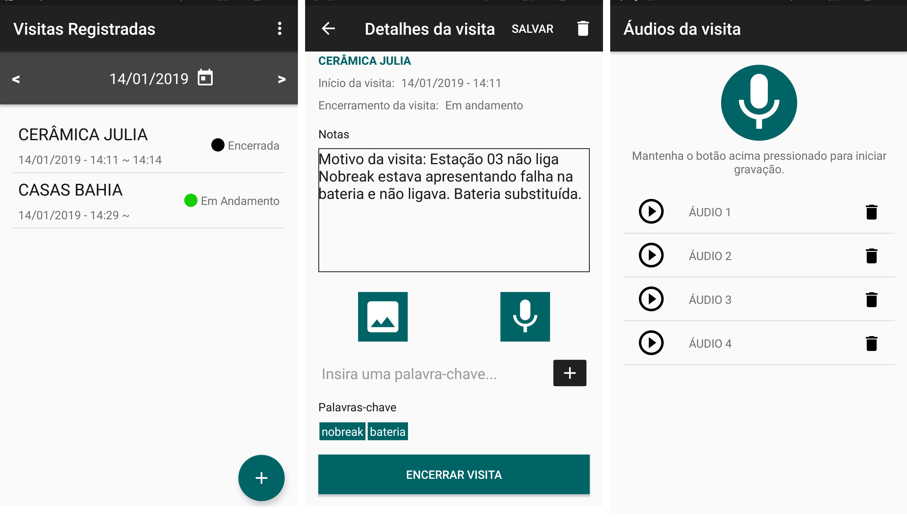

# Controle de Visitas - Android App

> This is a native android app created for technicians to keep track of on-site technical supports.

## Features

- Keep track of on-site supports and add content to them
- Schedule new technical visit
- Audio recording holding button
- Images selecting from camera or gallery
- Realtime database provided by Firebase
- Firebase Storage for images and audios

## Built With

- Firebase Storage
- SiliCompressor
- Picasso
- MediaRecorder
- MediaPlayer
- Flexbox Layout
- RecyclerView
- Time & Date Pickers

## Video Demo

[Video - App Demo](https://www.youtube.com/watch?v=TzI9oUu-F_8)

## Download .apk

[ControleVisitas.apk](https://goo.gl/bjNyDt)

## 👤 Author 

- Github: [@flpfar](https://github.com/flpfar)
- Twitter: [@flpfar](https://twitter.com/flpfar)
- Linkedin: [Felipe Augusto Rosa](https://www.linkedin.com/in/felipe-augusto-rosa-7b96a4b1)

## Notes

This app was built as a part of the course Systems Development for Mobile Devices, from the Federal Institute of São Paulo (IFSP) - Campus São Carlos.

## 🤝 Contributing

Contributions, issues and feature requests are welcome!

Feel free to check the [issues page](issues/).

## Show your support

Give a ⭐️ if you like this project!
